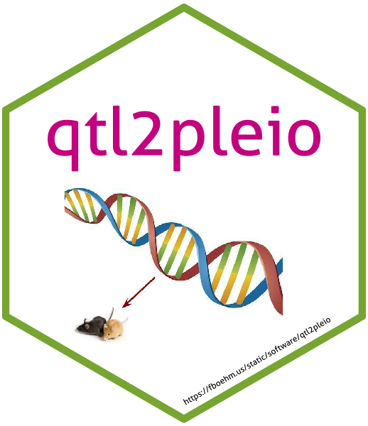
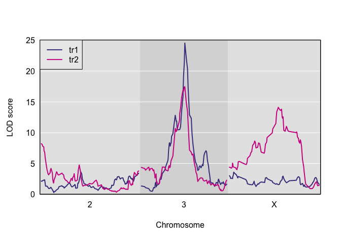
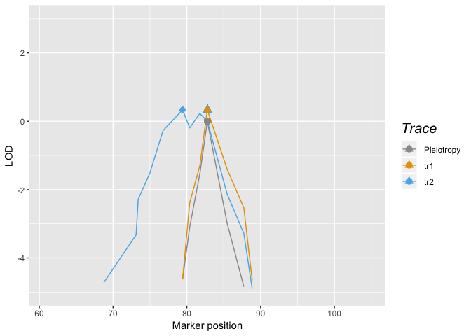

<!-- README.md is generated from README.Rmd. Please edit that file -->

# qtl2pleio 

[](https://travis-ci.org/fboehm/qtl2pleio)
[](https://codecov.io/github/fboehm/qtl2pleio?branch=master)
[](https://www.repostatus.org/#wip)

## Goals

The goal of qtl2pleio is to perform a likelihood ratio test that
distinguishes between competing hypotheses of presence of two separate
QTL (alternative hypothesis) and pleiotropy (null hypothesis) in QTL
studies in multiparental populations, such as the Diversity Outbred
mouse population. `qtl2pleio` data structures are those used in the
`rqtl/qtl2` package.

## Installation

``` r
install.packages("devtools")
devtools::install_github("fboehm/qtl2pleio")
```

## Example

Below, we walk through an example analysis with Diversity Outbred mouse
data. We need a number of preliminary steps before we can perform our
test of pleiotropy vs. separate QTL. Many procedures rely on the R
package `qtl2`.

``` r
library(qtl2pleio)
```

We’ll work with data from the `qtl2data` repository, which is on github.
First, we install and load the `qtl2` package.

``` r
devtools::install_github("rqtl/qtl2")
```

We use the above line once to install the package on our computer before
loading the package with the `library` command.

``` r
library(qtl2)
```

### Reading data from `qtl2data` repository on github

We read from github.com data from the `qtl2data` repository.

``` r
tmpfile <- tempfile()
file <- paste0("https://raw.githubusercontent.com/rqtl/",
               "qtl2data/master/DOex/DOex_alleleprobs.rds")
download.file(file, tmpfile)
pr <- readRDS(tmpfile)
unlink(tmpfile)
tmpfile <- tempfile()
file <- paste0("https://raw.githubusercontent.com/rqtl/",
               "qtl2data/master/DOex/DOex_pmap.csv")
download.file(file, tmpfile)
pmap_pre <- read.csv(tmpfile)
unlink(tmpfile)
pm2 <- pmap_pre[pmap_pre$chr == 2, 3]
names(pm2) <- pmap_pre[pmap_pre$chr == 2, 1]
pm3 <- pmap_pre[pmap_pre$chr == 3, 3]
names(pm3) <- pmap_pre[pmap_pre$chr == 3, 1]
pmX <- pmap_pre[pmap_pre$chr == "X", 3]
names(pmX) <- pmap_pre[pmap_pre$chr == "X", 1]
list(pm2, pm3, pmX) -> pm
names(pm) <- c("`2`", "`3`", "X")
```

We now have an allele probabilities object stored in `pr`.

``` r
names(pr)
#> [1] "2" "3" "X"
dim(pr$`2`)
#> [1] 261   8 127
```

We see that `pr` is a list of 3 three-dimensional arrays - one array for
each of 3 chromosomes.

### Kinship calculations

For our statistical model, we need a kinship matrix. Although we don’t
have genome-wide data - since we have allele probabilities for only 3
chromosomes - let’s calculate a kinship matrix using
“leave-one-chromosome-out”. In practice, one would want to use allele
probabilities from a full genome-wide set of markers.

``` r
calc_kinship(probs = pr, type = "loco") -> kinship
```

``` r
str(kinship)
#> List of 3
#>  $ 2: num [1:261, 1:261] 0.6919 0.0707 0.2355 0.0558 0.0512 ...
#>   ..- attr(*, "n_pos")= int 195
#>   ..- attr(*, "dimnames")=List of 2
#>   .. ..$ : chr [1:261] "1" "4" "5" "6" ...
#>   .. ..$ : chr [1:261] "1" "4" "5" "6" ...
#>  $ 3: num [1:261, 1:261] 0.6642 0.0638 0.2035 0.1128 0.0772 ...
#>   ..- attr(*, "n_pos")= int 220
#>   ..- attr(*, "dimnames")=List of 2
#>   .. ..$ : chr [1:261] "1" "4" "5" "6" ...
#>   .. ..$ : chr [1:261] "1" "4" "5" "6" ...
#>  $ X: num [1:261, 1:261] 0.4853 0.0821 0.1958 0.1039 0.1123 ...
#>   ..- attr(*, "n_pos")= int 229
#>   ..- attr(*, "dimnames")=List of 2
#>   .. ..$ : chr [1:261] "1" "4" "5" "6" ...
#>   .. ..$ : chr [1:261] "1" "4" "5" "6" ...
```

We see that `kinship` is a list containing 3 matrices. Each matrix is
261 by 261 - where the number of subjects is 261 - and symmetric. The
\((i, j)\) cell in the matrix contains the estimate of identity-by-state
(IBS) probability for randomly chosen alleles at a single locus for
those two subjects.

Before we simulate phenotype data, we first specify our statistical
model.

We use the model:

\[vec(Y) = X vec(B) + vec(G) + vec(E)\]

where \(Y\) is a \(n\) by \(2\) matrix, where each row is one subject
and each column is one quantitative trait. \(X\) is a \(2n\) by \(2f\)
design matrix containing \(n\) by \(f\) allele probabilities matrices
for each of two (possibly identical) markers. Thus, \(X\) is a
block-diagonal matrix, with exactly two \(n\) by \(f\) blocks on the
diagonal. \(B\) is a \(f\) by 2 matrix. “vec” refers to the
vectorization operator. “vec(B)”, where \(B\) is a \(f\) by \(2\)
matrix, is, thus, a (column) vector of length \(2f\) that is formed by
stacking the second column of \(B\) beneath the first column of \(B\).

\(G\) is a matrix of random effects. We specify its distribution as
matrix-variate normal with mean being a \(n\) by \(2\) matrix of zeros,
covariance among row vectors a \(n\) by \(n\) kinship matrix, \(K\), and
covariance among column vectors a \(2\) by \(2\) genetic covariance
matrix, \(V_g\).

In mathematical notation, we write:

\[G \sim MN_{\text{n by 2}}(0, K, V_g)\]

We also need to specify the distribution of the \(E\) matrix, which
contains the random errors. \(E\) is a random \(n\) by \(2\) matrix that
is distributed as a matrix-variate normal distribution with mean being
the \(n\) by \(2\) zero matrix, covariance among row vectors \(I_n\),
the \(n\) by \(n\) identity matrix, and covariance among columns the
\(2\) by \(2\) matrix \(V_e\).

\[E \sim MN_{\text{n by 2}}(0, I_n, V_e)\]

In practice, we typically observe the phenotype matrix \(Y\). We also
treat as known the design matrix \(X\) and the kinship matrix \(K\). We
then infer the values of \(B\), \(V_g\), and \(V_e\).

### Simulating phenotypes with `qtl2pleio::sim1`

The function to simulate phenotypes in `qtl2pleio` is `sim1`. By
examining its help page, we see that it takes five arguments. The help
page also gives the dimensions of the inputs.

``` r
# set up the design matrix, X
pp <- pr[[2]]
X <- gemma2::stagger_mats(pp[ , , 50], pp[ , , 50])
# assemble B matrix of allele effects
B <- matrix(data = c(-1, -1, -1, -1, 1, 1, 1, 1, -1, -1, -1, -1, 1, 1, 1, 1), nrow = 8, ncol = 2, byrow = FALSE)
# verify that B is what we want:
B
#>      [,1] [,2]
#> [1,]   -1   -1
#> [2,]   -1   -1
#> [3,]   -1   -1
#> [4,]   -1   -1
#> [5,]    1    1
#> [6,]    1    1
#> [7,]    1    1
#> [8,]    1    1
# set.seed to ensure reproducibility
set.seed(2018-01-30)
# call to sim1
Ypre <- sim1(X = X, B = B, Vg = diag(2), Ve = diag(2), kinship = kinship[[2]])
Y <- matrix(Ypre, nrow = 261, ncol = 2, byrow = FALSE)
rownames(Y) <- rownames(pp)
colnames(Y) <- c("tr1", "tr2")
```

Let’s perform univariate QTL mapping for each of the two traits in the Y
matrix.

``` r
scan1(genoprobs = pr, pheno = Y, kinship = kinship) -> s1
```

``` r
plot(s1, pm)
```



``` r
find_peaks(s1, map = pm)
#>   lodindex lodcolumn chr       pos       lod
#> 1        1       tr1 `2` 75.562440  3.636498
#> 2        1       tr1 `3` 82.778059 24.552172
#> 3        1       tr1   X 13.406552  3.585519
#> 4        2       tr2 `2`  3.164247  8.195879
#> 5        2       tr2 `3` 82.778059 17.454825
#> 6        2       tr2   X 95.069663 14.110670
```

### Perform two-dimensional scan as first step in pleiotropy v separate QTL hypothesis test

``` r
out <- scan_pvl(probs = pp, 
                pheno = Y, 
                kinship = kinship[[2]], # 2nd entry in kinship list is Chr 3
                start_snp = 38, 
                n_snp = 25, n_cores = 1
                )
#> starting covariance matrices estimation with data from 261 subjects.
#> covariance matrices estimation completed.
```

#### Create a profile LOD plot to visualize results of two-dimensional scan

``` r
library(dplyr)
#> 
#> Attaching package: 'dplyr'
#> The following objects are masked from 'package:stats':
#> 
#>     filter, lag
#> The following objects are masked from 'package:base':
#> 
#>     intersect, setdiff, setequal, union
out %>% 
  tidy_scan_pvl(pm3) %>% # pm3 is physical map for Chr 3
  add_intercepts(intercepts_univariate = c(82.8, 82.8)) %>%
  plot_pvl(phenames = c("tr1", "tr2"))
#> Warning: Removed 50 rows containing missing values (geom_path).
```



#### Calculate the likelihood ratio test statistic for pleiotropy v separate QTL

We use the function `calc_lrt_tib` to calculate the likelihood ratio
test statistic value for the specified traits and specified genomic
region.

``` r
(calc_lrt_tib(out) -> lrt)
#> [1] 0.7730965
```

### Bootstrap analysis to get p-values

The calibration of test statistic values to get p-values uses bootstrap
methods because we don’t know the theoretical distribution of the test
statistic under the null hypothesis. Thus, we use a bootstrap approach
to obtain an empirical distribution of test statistic values under the
null hypothesis of the presence of one pleiotropic locus.

We will use the function `boot_pvl` from our package `qtl2pleio`.

We use a parametric bootstrap strategy in which we first use the studied
phenotypes to infer the values of model parameters. Once we have the
inferred values of the model parameters, we simulate phenotypes from the
pleiotropy model (with the inferred parameter values).

A natural question that arises is “which marker’s allele probabilities
do we use when simulating phenotypes?” We use the marker that, under the
null hypothesis, ie, under the pleiotropy constraint, yields the
greatest value of the log-likelihood.

Before we call `boot_pvl`, we need to identify the index (on the
chromosome under study) of the marker that maximizes the likelihood
under the pleiotropy constraint. To do this, we use the `qtl2pleio`
function `find_pleio_peak_tib`.

``` r
(pleio_index <- find_pleio_peak_tib(out, start_snp = 38))
#> loglik13 
#>       50
```

``` r
set.seed(2018-11-25)
system.time(b_out <- boot_pvl(probs = pp,
         pheno = Y, 
         pleio_peak_index = pleio_index, 
         kinship = kinship[[2]], # 2nd element in kinship list is Chr 3 
         nboot_per_job = 10, 
         start_snp = 38, 
         n_snp = 25
         ))
#> starting covariance matrices estimation with data from 261 subjects.
#> covariance matrices estimation completed.
#> starting covariance matrices estimation with data from 261 subjects.
#> covariance matrices estimation completed.
#> starting covariance matrices estimation with data from 261 subjects.
#> covariance matrices estimation completed.
#> starting covariance matrices estimation with data from 261 subjects.
#> covariance matrices estimation completed.
#> starting covariance matrices estimation with data from 261 subjects.
#> covariance matrices estimation completed.
#> starting covariance matrices estimation with data from 261 subjects.
#> covariance matrices estimation completed.
#> starting covariance matrices estimation with data from 261 subjects.
#> covariance matrices estimation completed.
#> starting covariance matrices estimation with data from 261 subjects.
#> covariance matrices estimation completed.
#> starting covariance matrices estimation with data from 261 subjects.
#> covariance matrices estimation completed.
#> starting covariance matrices estimation with data from 261 subjects.
#> covariance matrices estimation completed.
#>    user  system elapsed 
#> 184.168   2.012 186.441
```

The argument `nboot_per_job` indicates the number of bootstrap samples
that will be created and analyzed. Here, we set `nboot_per_job = 10`, so
we expect to see returned a numeric vector of length 10, where each
entry is a LRT statistic value from a distinct bootstrap sample.

Finally, we determine a bootstrap p-value in the usual method. We treat
the bootstrap samples’ test statistics as an empirical distribution of
the test statistic under the null hypothesis of pleiotropy. Thus, to get
a p-value, we want to ask “What is the probability, under the null
hypothesis, of observing a test statistic value that is at least as
extreme as that which we observed?”

``` r
b_out
#>  [1] 0.0000000 0.0000000 0.4512753 0.0000000 0.0000000 0.0000000 0.0000000
#>  [8] 0.0000000 0.0000000 0.9867788
(pvalue <- mean(b_out >= lrt))
#> [1] 0.1
```

In practice, one would want to use many more bootstrap samples to
achieve an empirical distribution that is closer to the theoretical
distribution of the test statistic under the null hypothesis.

However, if one wants to perform analyses with a reasonable number - say
400 - bootstrap samples, this will take a very long time - many days -
on a single laptop computer. We have used a series of computer clusters
that are coordinated by the University of Wisconsin-Madison’s Center for
High-throughput Computing (<http://chtc.cs.wisc.edu>). We typically are
able to analyze 1000 bootstrap samples in less than 24 hours with this
service.

## Code of Conduct

Please note that this project is released with a [Contributor Code of
Conduct](CONDUCT.md). By participating in this project you agree to
abide by its terms.

## Citation information

``` r
citation("qtl2pleio")
#> 
#> To cite qtl2pleio in publications use:
#> 
#>   Frederick Boehm (2018). qtl2pleio: Testing pleiotropy vs.
#>   separate QTL in multiparental populations. R package version
#>   0.1.2.9000. URL https://github.com/fboehm/qtl2pleio
#> 
#> A BibTeX entry for LaTeX users is
#> 
#>   @Manual{,
#>     title = {qtl2pleio: Testing pleiotropy vs. separate QTL in multiparental populations},
#>     author = {Frederick Boehm},
#>     year = {2018},
#>     note = {R package version 0.1.2.9000},
#>     url = {https://github.com/fboehm/qtl2pleio},
#>   }
```
