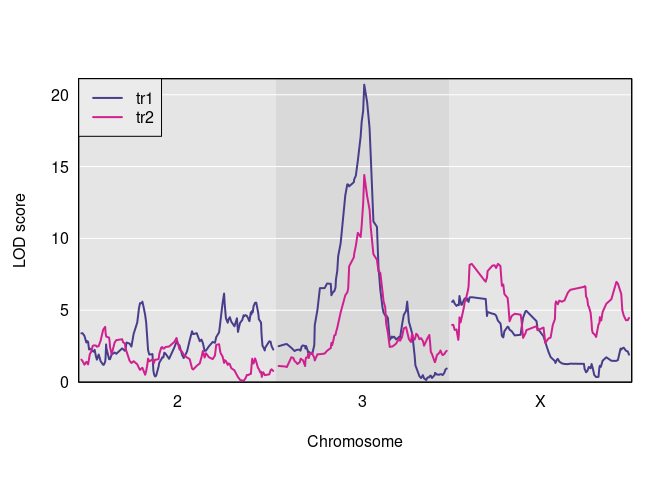
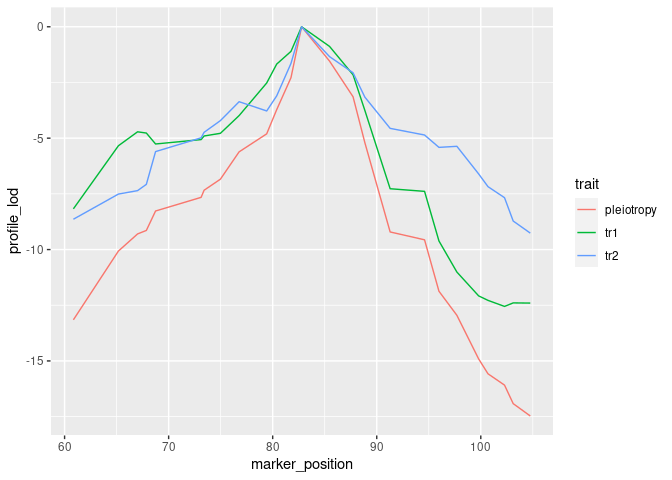

<!-- README.md is generated from README.Rmd. Please edit README.Rmd -->

# qtl2pleio

[](https://mybinder.org/v2/gh/fboehm/qtl2pleio/master?urlpath=rstudio)
[](https://travis-ci.org/fboehm/qtl2pleio)
[](https://codecov.io/github/fboehm/qtl2pleio?branch=master)
[](https://www.repostatus.org/#active)

## Overview

`qtl2pleio` is a software package for use with the [R statistical
computing environment](https://cran.r-project.org/). `qtl2pleio` is
freely available for download and use. I share it under the [MIT
license](https://opensource.org/licenses/mit-license.php). The user will
also want to download and install the [`qtl2` R
package](https://kbroman.org/qtl2/).

Click
[here](https://mybinder.org/v2/gh/fboehm/qtl2pleio/master?urlpath=rstudio)
to explore `qtl2pleio` within a live [Rstudio](https://www.rstudio.com/)
session in “the cloud”.

## Goals

The goal of `qtl2pleio` is, for a pair of traits that show evidence for
a QTL in a common region, to distinguish between pleiotropy (the null
hypothesis, that they are affected by a common QTL) and the alternative
that they are affected by separate QTL. It extends the likelihood ratio
test of [Jiang and Zeng
(1995)](http://www.genetics.org/content/140/3/1111.long) for
multiparental populations, such as Diversity Outbred mice, including the
use of multivariate polygenic random effects to account for population
structure. `qtl2pleio` data structures are those used in the
[`rqtl/qtl2`](https://kbroman.org/qtl2) package.

## Installation

To install qtl2pleio, use `install_github()` from the
[devtools](https://devtools.r-lib.org) package.

``` r
install.packages("devtools")
devtools::install_github("fboehm/qtl2pleio")
```

You may also wish to install [R/qtl2](https://kbroman.org/qtl2) and the
[`qtl2convert`](https://github.com/rqtl/qtl2convert) package. We will
use both
below.

``` r
install.packages(c("qtl2", "qtl2convert"), repos="http://rqtl.org/qtl2cran")
#> 
#> The downloaded binary packages are in
#>  /var/folders/wd/lxmyvz590xb81c5z1j88b3800000gn/T//RtmpQMynXh/downloaded_packages
```

## Example

Below, we walk through an example analysis with Diversity Outbred mouse
data. We need a number of preliminary steps before we can perform our
test of pleiotropy vs. separate QTL. Many procedures rely on the R
package `qtl2`. We first load the `qtl2`, `qtl2convert`, and `qtl2pleio`
packages.

``` r
library(qtl2)
library(qtl2convert)
library(qtl2pleio)
```

### Reading data from `qtl2data` repository on github

We’ll consider the
[`DOex`](https://github.com/rqtl/qtl2data/tree/master/DOex) data in the
[`qtl2data`](https://github.com/rqtl/qtl2data) repository. We’ll
download the DOex.zip file before calculating founder allele dosages.

``` r
file <- paste0("https://raw.githubusercontent.com/rqtl/",
               "qtl2data/master/DOex/DOex.zip")
DOex <- read_cross2(file)
```

``` r
probs <- calc_genoprob(DOex)
```

Let’s calculate the founder allele dosages from the 36-state genotype
probabilities.

``` r
pr <- genoprob_to_alleleprob(probs)
```

We now have an allele probabilities object stored in `pr`.

``` r
names(pr)
#> [1] "2" "3" "X"
dim(pr$`2`)
#> [1] 261   8 127
```

We see that `pr` is a list of 3 three-dimensional arrays - one array for
each of 3 chromosomes.

### Kinship calculations

For our statistical model, we need a kinship matrix. We get one with the
`calc_kinship` function in the `rqtl/qtl2` package.

``` r
kinship <- calc_kinship(probs = pr, type = "loco")
```

``` r
str(kinship)
#> List of 3
#>  $ 2: num [1:261, 1:261] 0.6934 0.0705 0.2356 0.0558 0.0513 ...
#>   ..- attr(*, "n_pos")= int 195
#>   ..- attr(*, "dimnames")=List of 2
#>   .. ..$ : chr [1:261] "1" "4" "5" "6" ...
#>   .. ..$ : chr [1:261] "1" "4" "5" "6" ...
#>  $ 3: num [1:261, 1:261] 0.6662 0.0647 0.2024 0.1129 0.0772 ...
#>   ..- attr(*, "n_pos")= int 220
#>   ..- attr(*, "dimnames")=List of 2
#>   .. ..$ : chr [1:261] "1" "4" "5" "6" ...
#>   .. ..$ : chr [1:261] "1" "4" "5" "6" ...
#>  $ X: num [1:261, 1:261] 0.4871 0.0831 0.1953 0.1043 0.1125 ...
#>   ..- attr(*, "n_pos")= int 229
#>   ..- attr(*, "dimnames")=List of 2
#>   .. ..$ : chr [1:261] "1" "4" "5" "6" ...
#>   .. ..$ : chr [1:261] "1" "4" "5" "6" ...
```

### Statistical model specification

We use the multivariate linear mixed effects model:

\[vec(Y) = X vec(B) + vec(G) + vec(E)\]

where \(Y\) contains phenotypes, X contains founder allele probabilities
and covariates, and B contains founder allele effects. G is the
polygenic random effects, while E is the random errors. We provide more
details in the vignette.

### Simulating phenotypes with `qtl2pleio::sim1`

The function to simulate phenotypes in `qtl2pleio` is `sim1`.

``` r
# set up the design matrix, X
pp <- pr[[2]] #we'll work with Chr 3's genotype data
```

``` r
#Next, we prepare a design matrix X
X <- gemma2::stagger_mats(pp[ , , 50], pp[ , , 50])
```

``` r
# assemble B matrix of allele effects
B <- matrix(data = c(-1, -1, -1, -1, 1, 1, 1, 1, -1, -1, -1, -1, 1, 1, 1, 1), nrow = 8, ncol = 2, byrow = FALSE)
# set.seed to ensure reproducibility
set.seed(2018-01-30)
# call to sim1
Ypre <- sim1(X = X, B = B, Vg = diag(2), Ve = diag(2), kinship = kinship[[2]])
Y <- matrix(Ypre, nrow = 261, ncol = 2, byrow = FALSE)
rownames(Y) <- rownames(pp)
colnames(Y) <- c("tr1", "tr2")
```

Let’s perform univariate QTL mapping for each of the two traits in the Y
matrix.

``` r
s1 <- scan1(genoprobs = pr, pheno = Y, kinship = kinship)
```

Here is a plot of the results.

``` r
plot(s1, DOex$pmap)
plot(s1, DOex$pmap, lod=2, col="violetred", add=TRUE)
legend("topleft", colnames(s1), lwd=2, col=c("darkslateblue", "violetred"), bg="gray92")
```



And here are the observed QTL peaks with LOD \> 8.

``` r
find_peaks(s1, map = DOex$pmap, threshold=8)
#>   lodindex lodcolumn chr       pos      lod
#> 1        1       tr1   3  82.77806 16.19704
#> 2        2       tr2   3  82.77806 18.26406
#> 3        2       tr2   X 103.79061 16.19708
```

### Perform two-dimensional scan as first step in pleiotropy vs. separate QTL hypothesis test

We now have the inputs that we need to do a pleiotropy vs. separate QTL
test. We have the founder allele dosages for one chromosome, *i.e.*, Chr
3, in the R object `pp`, the matrix of two trait measurements in `Y`,
and a LOCO-derived kinship matrix, `kinship[[2]]`.

``` r
out <- suppressMessages(scan_pvl(probs = pp,
                pheno = Y,
                kinship = kinship[[2]], # 2nd entry in kinship list is Chr 3
                start_snp = 38,
                n_snp = 25, n_cores = 1
                ))
```

### Create a profile LOD plot to visualize results of two-dimensional scan

To visualize results from our two-dimensional scan, we calculate profile
LOD for each trait. The code below makes use of the R package `ggplot2`
to plot profile LODs over the scan region.

``` r
library(dplyr)
out %>%
  tidy_scan_pvl(DOex$pmap[[2]]) %>% # pmap[[2]] is physical map for Chr 3
  plot_pvl()
```



### Calculate the likelihood ratio test statistic for pleiotropy v separate QTL

We use the function `calc_lrt_tib` to calculate the likelihood ratio
test statistic value for the specified traits and specified genomic
region.

``` r
(lrt <- calc_lrt_tib(out))
#> [1] 0
```

### Bootstrap analysis to get p-values

Before we call `boot_pvl`, we need to identify the index (on the
chromosome under study) of the marker that maximizes the likelihood
under the pleiotropy constraint. To do this, we use the `qtl2pleio`
function `find_pleio_peak_tib`.

``` r
(pleio_index <- find_pleio_peak_tib(out, start_snp = 38))
#> loglik13 
#>       50
```

``` r
set.seed(2018-11-25) # set for reproducibility purposes.
b_out <- suppressMessages(boot_pvl(probs = pp,
         pheno = Y,
         pleio_peak_index = pleio_index,
         kinship = kinship[[2]], # 2nd element in kinship list is Chr 3
         nboot_per_job = 10,
         start_snp = 38,
         n_snp = 25
         ))
```

``` r
(pvalue <- mean(b_out >= lrt))
#> [1] 1
```

## Code of Conduct

Please note that this project is released with a [Contributor Code of
Conduct](CONDUCT.md). By participating in this project you agree to
abide by its terms.

## Citation information

``` r
citation("qtl2pleio")
#> 
#> To cite qtl2pleio in publications use:
#> 
#>   Boehm FJ, Chesler EJ, Yandell BS, Broman KW (2019) Testing
#>   pleiotropy vs. separate QTL in multiparental populations Biorxiv
#>   https://www.biorxiv.org/content/10.1101/550939v1
#> 
#> A BibTeX entry for LaTeX users is
#> 
#>   @Article{Boehm2019testing,
#>     title = {Testing pleiotropy vs. separate QTL in multiparental populations},
#>     author = {Frederick J. Boehm and Elissa J. Chesler and Brian S. Yandell and Karl W. Broman},
#>     journal = {Biorxiv},
#>     year = {2019},
#>     url = {https://www.biorxiv.org/content/10.1101/550939v1},
#>     eprint = {https://www.biorxiv.org/content/early/2019/02/15/550939.full.pdf},
#>   }
```
